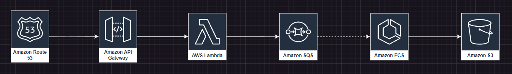

## AWS Message Processor

Aplikacja do przetwarzania wiadomości w czasie rzeczywistym w AWS.

Ogólny zarys projektu jest następujący:

1. Domena skonfigurowana w Route53 kieruje ruch do API Gateway
2. API Gateway - odbiera wiadomości od klientów poprzez interfejs HTTP
3. Lambda - przetwarza wstępnie wiadomości dodając wymagany kontekst (symulacja) i wysyła je do kolejki SQS
4. SQS - kolejka wiadomości do przetworzenia przez workery w ECS
5. ECS - kontenery Dockerowe z aplikacją Spring Boot, które przetwarzają (symulacja) wiadomości z kolejki SQS i zapisują
   je w S3
6. S3 - przechowuje przetworzone wiadomości w formacie JSON do dalszego przetwarzania przez inne systemy



Całość jest zautomatyzowana przy pomocy Terraform. Wystarczy wykonać `terraform apply` i wszystkie zasoby zostaną
utworzone.

Uwagi:
EKS - Kubernetes w AWS - nie jest używany, ponieważ jest to rozwiązanie droższe i bardziej skomplikowane niż ECS.

### Wymagania

#### Wymagania funkcjonalne

- Aplikacja musi umożliwiać przetwarzanie wiadomości w czasie rzeczywistym
- Aplikacja musi umożliwiać przetwarzanie wiadomości w formacie JSON
- Aplikacja msui zapisywać przetworzone wiadomości w formacie JSON w S3

#### Wymagania niefunkcjonalne

- Konfiguracaja w całości poprzez kod (Infrastructure as Code) - Terraform
- Automatyzacja procesu budowania i wdrażania aplikacji - GitHub Actions
- Automatyzacja procesu testowania aplikacji - GitHub Actions
- Automatyzacja procesu przetwarzania wiadomości - AWS Lambda, AWS ECS
- Automatyzacja procesu monitorowania aplikacji - AWS CloudWatch
- Automatyzacja procesu logowania aplikacji - AWS CloudWatch
- Przechowywanie konfiguracji aplikacji w bezpiecznym miejscu - AWS Secrets Manager

### Komponenty

#### API Gateway

#### Lambda

Prosta lambda odbierająca wiadomości od klientów, dodająca losowy ciąg znaków (symulacja) i wysyłająca je do kolejki
SQS.

#### SQS

Kolejka wiadomości do przetworzenia przez workery w ECS.

#### ECS

Kontenery Dockerowe z aplikacją Spring Boot, które przetwarzają dodaj(symulacja) wiadomości z kolejki SQS i zapisują je
w S3.

#### S3

Przechowuje przetworzone wiadomości w formacie JSON do dalszego przetwarzania przez inne systemy (symulacja).

### Install

#### Build

1. Zainstaluj JDK 21
2. Zbuduj aplikację:

```
./mavenw.bat clean compile package
```

#### Deploy to AWS

Uwaga: deploy uruchamia jeden działający proces w AWS ECS Fargate, który jest płatny nawet pomimo posiadania free tier. Należy zwrócić uwagę na koszty

1. Zainstaluj AWS CLI
2. Skonfiguruj AWS CLI
3. Push obrazu aws-mp-message-saver do ECR powinien być wykonany automatycznie przez GitHub Actions (TODO) - ręcznie push
   obrazu można wykonać poleceniem opisanym w `View push commands` w konsoli ECR. Zazwyczaj wygląda to tak:
```
skonfigurwoać AWS CLI
komendy do wykonania w PowerShell:
(Get-ECRLoginCommand).Password | docker login --username AWS --password-stdin <adres_ECR>
docker tag mg/aws-mp:latest <adres_ECR>/mg/aws-mp:latest
docker push <adres_ECR>/mg/aws-mp:latest
```
4. Skonfiguruj Terraform w katalogu `aws` jeśli nie ma w nim katalogu `.terraform`:
   ```
   terraform init
   ```
5. Uruchom w katalogu `aws` najpierw testując konfigurację:
    ```
    terraform plan
    ```
   a następnie wdrażając konfigurację:
    ```
    terraform apply
    ```
6. Github Actions - budowanie projektu i deploy nowej wersji taska oraz serwisu do ECS na AWS
